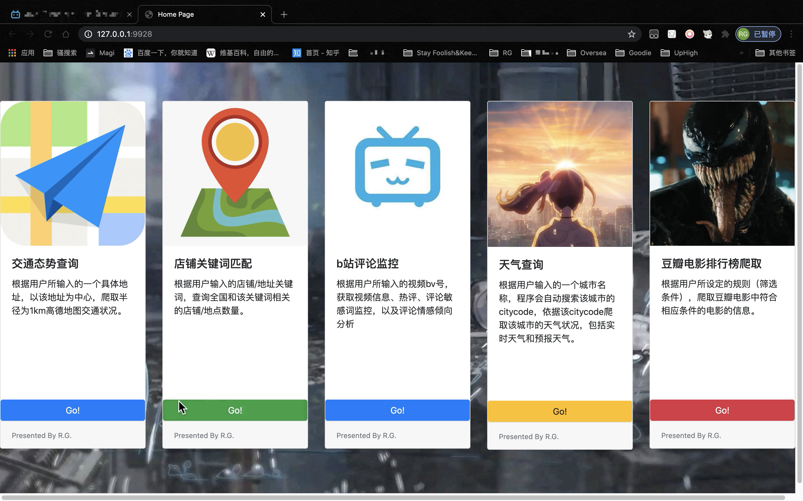

# RGcrawl

### Brief intro

Bilibili Comment Monitoring System + Python Webcrawler Design. Combine these 2 projects into this RGcrawl repo.

Used Python packages: Flask, Bootstrap, BeautifulSoup, Re, Requests, etc.

RGcrawl contains 5 modules:

+ Traffic situational awareness (交通态势感知)：Obtain real-time traffic conditions within a radius of 1 km from the user's input address
+ Store Keyword Matching (店铺关键词匹配)：Obtain the number of stores/locations related to changing keywords nationwide according to the store/address keywords entered by users
+ Bilibili Comment Monitoring System (b站评论监控)：Obtain the basic information and comment information of the video, monitor the sensitive words in the comment area and analyze the sentiment orientation of the comments
+ Weather report (天气查询): Obtain the real-time weather conditions of the input location and the weather forecast
+ Douban movie ranking list (豆瓣电影排行榜爬取): Get top rank movies' information of Douban movie ranking list

## Note

According to the requirements of the project, all the core codes are in the `app.py`  file and are not divided into independent module files. A more reasonable programming style is to split each functional module into each module file.

